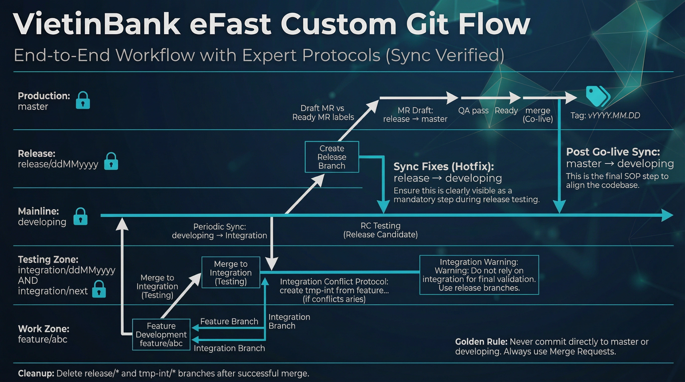

We’ve all been there. It’s the day before a major release. Ten new features have been tested, merged, and are sitting in a `release` branch, ready for deployment. Then the call comes in: "Feature X has a critical bug. We can’t release it."

With standard Git Flow, you’re now in a world of pain. Do you try a `git revert`, risking a tangled mess of conflicts? Do you delay the entire release for one bad feature? This exact scenario is why we abandoned the standard model and built our own custom Git Flow.

This isn’t just another article about branching strategies. This is a story about how we solved the single most stressful problem in release management: **how to surgically remove one feature from a release without breaking the other nine.**

### The Diagram That Makes It Possible

First, here’s the map of our world. It looks complex, but its entire structure is designed to solve that one core problem.

### The Core Problem: The Tangled Release Branch

In a typical Git Flow, multiple `feature` branches are merged directly into `developing`. When it’s time to release, you create a `release` branch from `developing`. At this point, all those features are bundled together. They are a single, tangled unit. Trying to remove one is like trying to un-bake a cake.

A `git revert` on the merge commit for the bad feature often leads to a cascade of new conflicts, especially if other features touched the same files. It’s risky, error-prone, and not something you want to be doing at 2 AM with a banking app that serves millions.

### Our Solution: Isolation and Intentional Merging

Our workflow’s power comes from one fundamental principle: **the `developing` branch is kept pristine.** Features are *never* merged directly into it before they are fully approved for release. Instead, they are merged into an `integration` branch for testing.

This isolation is the key. Here’s how it allows for surgical rollbacks:

**Scenario:** Ten features are on the `integration` branch. UAT (User Acceptance Testing) begins. Nine features pass, but Feature #7 fails catastrophically.

**The Rollback Process (The Easy Way):**

1.  **Do Nothing:** We don’t revert. We don’t try to untangle anything. We simply abandon the current `release` candidate that was built from `integration`.

2.  **Create a New Release:** We create a brand new, clean `release` branch directly from `developing` (which, remember, doesn’t have any of these ten features yet).

3.  **Merge the Winners:** We then merge the **nine approved feature branches** one by one into this new `release` branch.

4.  **Leave the Loser Behind:** The problematic Feature #7 is simply not included. It stays in its own branch, waiting to be fixed, without ever touching the new release.

That’s it. No reverts. No conflict hell. The release goes out on time with the nine good features. The problematic feature is sent back to the drawing board. This process is clean, safe, and repeatable.

### The Supporting Cast: Syncs and Safe Zones

While the rollback capability is the star of the show, a few other rules make it all possible:

*   **Sync Fixes (Hotfix):** If a bug is found in the *new* `release` branch (with the nine good features), we fix it there and immediately merge that fix back to `developing`. This prevents branch drift and ensures the fix is in the baseline for the next cycle.

*   **Post Go-live Sync:** After the release goes to `master`, we sync `master` back to `developing`. This ensures our mainline is a perfect mirror of production, ready for the next round of development.

*   **Integration Conflict Protocol:** Our `tmp-int` process provides a safe sandbox to handle merge conflicts between features *before* they even hit the `integration` branch, keeping our testing environment stable.

### The Real-World Payoff

This workflow isn’t just theoretical. It has saved our releases on multiple occasions. By reframing the problem from "How do we revert a bad feature?" to "How do we build a release with only the good features?", we’ve made our deployment process dramatically safer and less stressful.

If your team has ever been held hostage by a single problematic feature in a release, I highly recommend rethinking your flow. Isolate your features, merge with intention, and give yourself the power to un-merge. You might even get a full night’s sleep before a release. 🌙
