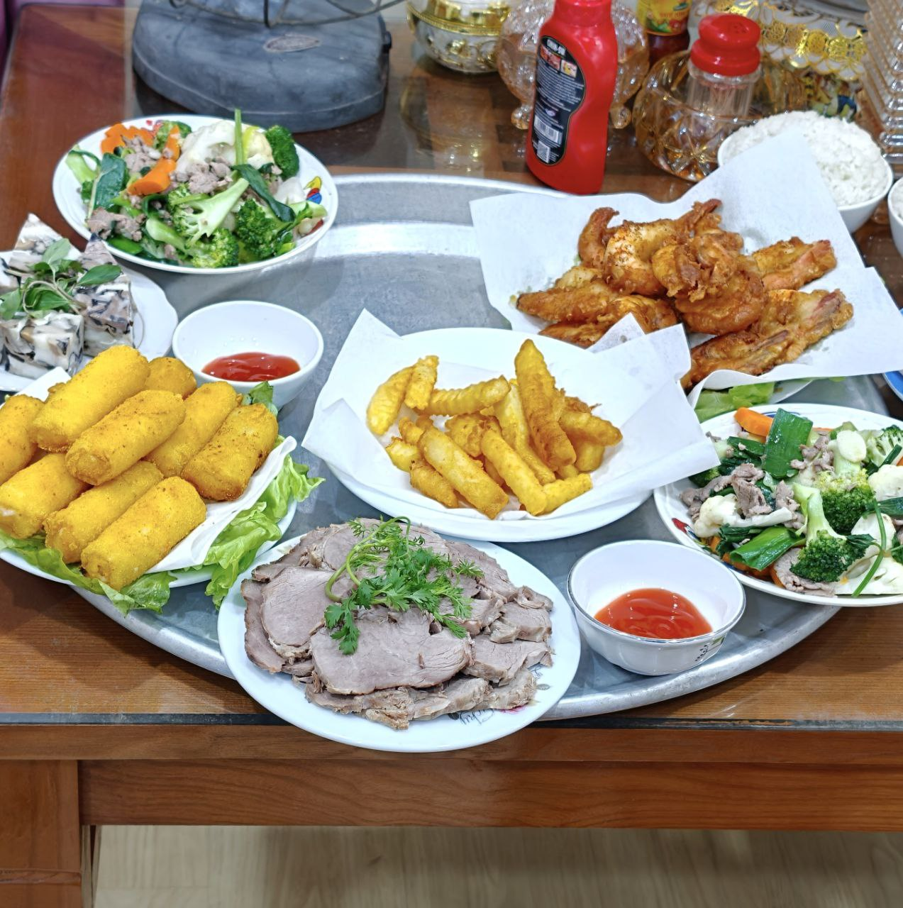

32 tuổi, tôi bắt đầu tự hỏi: từ khi nào Tết chỉ còn là một dấu chấm trên lịch?

Hồi bé, Tết không đến bằng ngày — Tết đến bằng mùi.

Mùi lá dong luộc, mùi mứt gừng, mùi nhang trầm quyện trong gió lạnh cuối năm.

Tôi nhớ cảm giác đứng trước gương ngắm bộ đồ mới mà tim đập nhanh, như thể sắp bước vào một thế giới khác.

Nhớ cái cách nâng niu tờ tiền lì xì, vuốt phẳng, ngắm đi ngắm lại rồi mới cẩn thận nhét vào túi áo.

Mâm cơm chiều ba mươi bày ra, tôi thấy món nào cũng sang — dù bây giờ nghĩ lại, chẳng có gì xa xỉ cả.

Nhưng ngày đó, mọi thứ đều lấp lánh.

Không phải vì chúng đẹp — mà vì chúng hiếm.

Và vì hiếm, nên thiêng.

Giờ thì sao?

Chúng ta sống giữa một cái Tết kéo dài 365 ngày.

Muốn gì có nấy, thích gì mua liền.

Đời sống tiện nghi đến mức không còn gì để mong.

Mà khi không còn gì để mong, thì niềm vui — thứ tưởng như luôn ở đó — lại lặng lẽ rút đi lúc nào không hay.

Tết không mất đi thứ gì.

Chỉ là chúng ta đã no trước khi ngồi vào bàn.

Nhưng bố mẹ tôi thì khác.

Bố mẹ không đếm thời gian bằng tháng, bằng quý.

Bố mẹ đếm bằng Tết.

Cả năm làm lụng, chờ đợi, chỉ để được vài ngày ngắn ngủi cả nhà quây quần bên bữa cơm tất niên, bữa cơm đầu năm, cùng nhau đi chúc Tết nội ngoại.

Với bố mẹ, Tết chưa bao giờ nhạt — vì điều bố mẹ mong chờ không phải quần áo mới hay mâm cao cỗ đầy, mà là có đủ mọi người bên cạnh.

Có lẽ đó mới là thứ khiến Tết thực sự là Tết.

Và có lẽ, khi nào tôi hiểu được điều đó bằng trái tim chứ không chỉ bằng lý trí — thì Tết sẽ lại đậm, như ngày xưa.

Nên năm nay, tôi tự hứa với mình một điều nhỏ thôi: bỏ điện thoại xuống lúc ngồi vào mâm cơm tất niên. Nhìn bố mẹ thật lâu một chút. Nghe ông bà kể lại câu chuyện cũ mà họ đã kể chục lần — và lần này, cười thật lòng.

Không phải để Tết đậm lại.

Mà để mình đậm lại.

